# FPGA Hardware Accelerator for Real-time Visual Inspection of Solar Panels  in Space Vehicles

---

## Table of Contents

- [Overview](#overview)
- [Key Design Highlights](#key-design-highlights)
- [System Architecture](#system-architecture)
- [Hardware Setup](#hardware-setup)
- [Features](#features)
- [Hardware & Software Requirements](#hardware--software-requirements)
- [Repository Structure](#repository-structure)
- [Results](#results)
- [Debugging & Validation](#debugging-&-validation)
- [Limitations & Future Work](#limitations--future-work)
- [Team](#team)
- [Supervisor](#supervisor)

---

## Overview

Solar panels in space vehicles are exposed to harsh environmental conditions that cause defects such as micro-cracks, dust accumulation, and delamination — all of which degrade power output and mission reliability. Manual or software-only inspection is too slow and resource-intensive for onboard, real-time use.

This project implements an **FPGA-based hardware accelerator** on the **DE1-SoC (Cyclone V)** that performs Sobel edge detection in hardware, with defect classification handled in C on the embedded ARM Cortex-A9 (HPS). The system achieves approximately **2× faster processing** compared to a CPU-only Python implementation.

**Defect classes detected:**
- 🔴 Physical damage (cracks / fractures)
- 🟡 Dust / surface contamination
- 🟢 Clean panel

---
## Key Design Highlights

- Designed a hardware–software co-design system using HPS–FPGA architecture  
- Accelerated Sobel edge detection using Verilog-based FPGA implementation  
- Implemented memory-mapped AXI interface via PIO for efficient data transfer  
- Achieved ~2× speedup compared to CPU-based implementation

---

## System Architecture

The system follows a **hardware–software co-design architecture**, where computationally intensive image processing is accelerated on FPGA, while control and decision-making are handled by the HPS (ARM processor).

### Architecture Overview

<p align="center">
  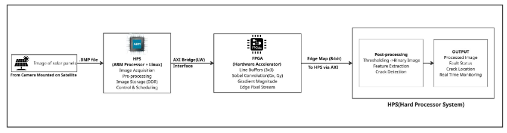
</p>
<p align="center"><em>Overall HPS–FPGA co-design architecture for solar panel defect detection</em></p>
### Data Flow

1. **Image Acquisition (HPS)**
   - Input solar panel image (.BMP)
   - Preprocessing: grayscale, resize, noise filtering

2. **HPS → FPGA Transfer**

<p align="center">
  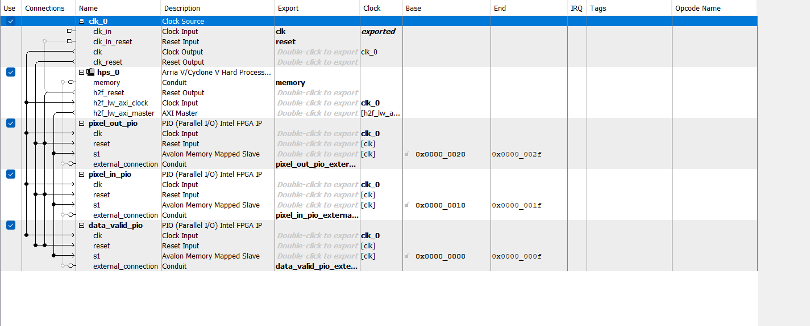
</p>
<p align="center"><em>Platform Designer setup showing HPS–FPGA AXI interface and PIO connections</em></p>

The HPS communicates with the FPGA through the **AXI Lightweight bridge**, using memory-mapped PIO registers.

- `pixel_out_pio` → Sends pixel data from HPS to FPGA  
- `pixel_in_pio` → Reads processed edge data from FPGA  
- `data_valid_pio` → Synchronization signal for valid data transfer  

> Uses memory-mapped I/O via LW AXI bridge (e.g., base address 0xFF200000) for low-latency communication.
3. **Sobel Edge Detection (FPGA Implementation)**

<p align="center">
  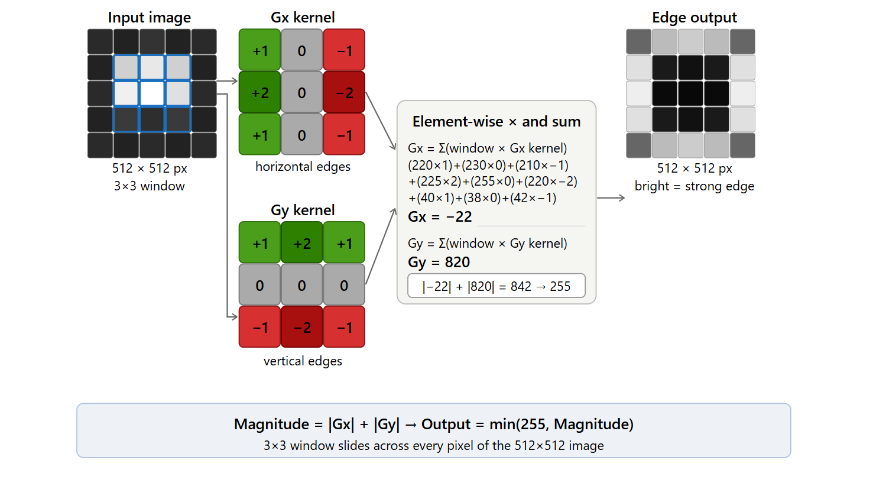
</p>
<p align="center"><em>Sobel operator showing Gx, Gy computation and gradient magnitude</em></p>

- Line buffer generates 3×3 sliding window  
- Sobel convolution computes **Gx, Gy** using kernel multiplication and addition  
- Gradient magnitude ≈ |Gx| + |Gy|  
- Thresholding → Edge map (8-bit)

> These operations are implemented in FPGA because they are **pixel-level, computation-intensive tasks**.  
> The FPGA performs these operations in hardware using dedicated logic, enabling **faster execution compared to sequential CPU processing**.  
> This results in reduced execution time for image processing tasks such as Sobel edge detection.
4. **FPGA → HPS Return**
   - Edge-detected image transferred back

5. **HPS Post-processing**
   - Morphological filtering  
   - Feature extraction  
   - Crack & dust classification  

6. **Output**
   - Annotated image + defect label (Crack / Dust / Clean)
## Hardware Setup

<p align="center">
  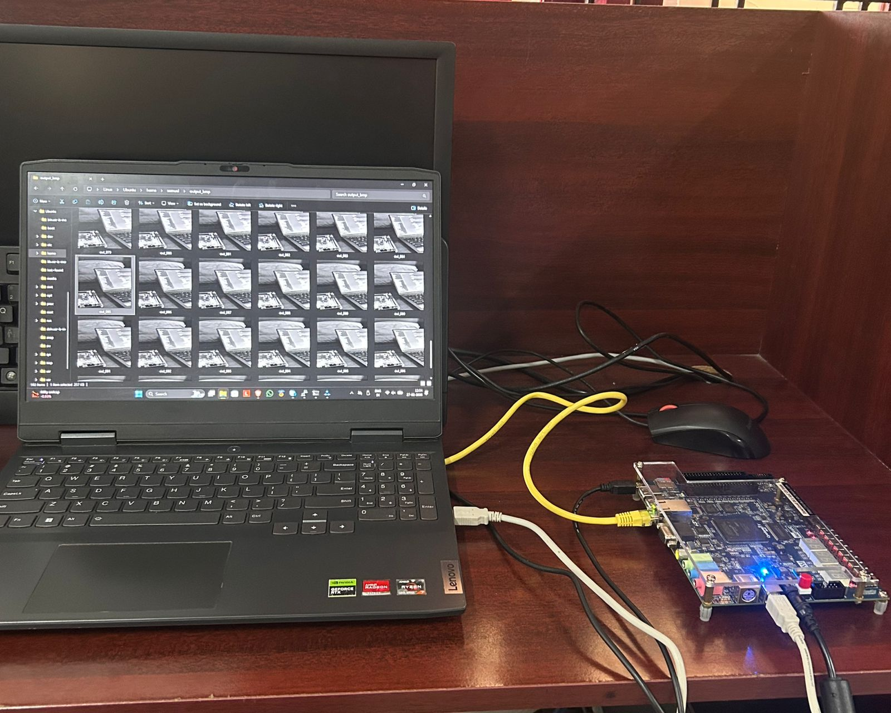
  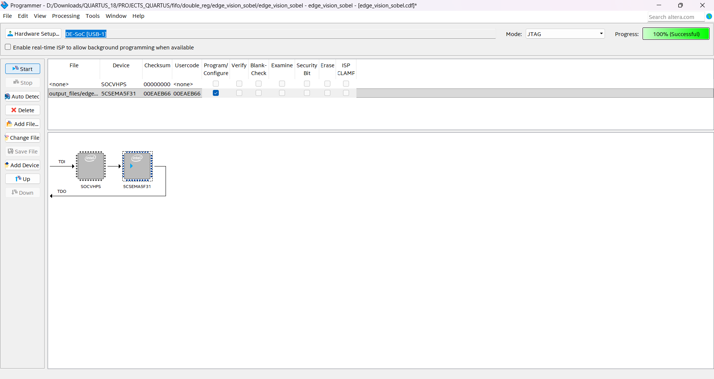
</p>
<p align="center">
  <em>Left: DE1-SoC FPGA board connected to host system | Right: Quartus Programmer showing successful FPGA configuration (100%)</em>
</p>

The FPGA design is deployed on the DE1-SoC board, where the HPS communicates with the FPGA fabric to perform hardware-accelerated Sobel edge detection and defect analysis.  

The design is synthesized and programmed using **Quartus Prime**, and the successful configuration of the FPGA is verified through the **Programmer tool (100% completion)**.
## Features

- Sobel edge detection implemented in **Verilog** on FPGA for deterministic, parallel execution
- **HPS–FPGA communication** via memory-mapped PIO registers over AXI Lightweight bridge
- Double flip-flop synchroniser for safe cross-clock-domain signal handling
- Parallel crack and dust classification pipelines running on the HPS
- Composite annotated output image with severity label, bounding box, and heatmap
- **~2× faster** than CPU (Python) implementation on 512×512 images

---

## Hardware & Software Requirements

| Component | Details |
|-----------|---------|
| FPGA Board | Terasic DE1-SoC (Intel Cyclone V, ARM Cortex-A9) |
| FPGA IDE | Intel Quartus Prime (with Platform Designer) |
| HPS OS | Embedded Linux (ARM) |
| HPS Compiler | `arm-linux-gnueabihf-gcc` |
| Verification | MATLAB R2022+ |
| Image format | BMP (512×512, 8-bit grayscale) |

---
## Repository Structure
```
fpga-solar-panel-fault-detection/
├── README.md
│
├── fpga/ # Verilog RTL + Quartus project
│ ├── edge_vision_sobel.v # Sobel edge detection module
│ ├── tb_sobel.v # Verilog testbench
│ ├── edgevision_pd.qsys # Platform Designer system
│ └── edge_vision_sobel.qpf # Quartus project file
│
├── hps/ # C code (HPS-side processing)
│ ├── hps_fpga_io.c # HPS–FPGA communication
│ └── hps_feature_extraction.c # Crack & dust detection logic
│
├── matlab/ # Verification & utilities
│ ├── sobel_matlab.m # MATLAB reference implementation
│ ├── jpg_bmp_conversion.m # Image conversion utility
│ └── jpeg_bmp_conversion.m # Alternate conversion script
│
├── dataset/ # Sample input images
│ ├── clean/
│ ├── dust/
│ └── physical_damages/
│
├── results/ # Output results and detections
│ ├── fpga_sobel_edge_detections/
│ ├── hps_crack_detections/
│ └── hps_dust_detections/
│
└── docs/ # Diagrams and execution screenshots
├── block.png
├── pd_interface.png
├── sobel_kernel.png
├── de1soc_setup.jpeg
├── quartus_programmer.png
└── execution_time_images...

```

> Note: Only sample images are included...

---

## Usage (DE1-SoC)

> Execution is performed directly on the DE1-SoC (HPS Linux environment).

### 1. Mount USB Drive

```bash
ls /dev/sd*
mkdir -p /mnt/usb
mount -t vfat /dev/sda1 /mnt/usb
```
### 2. Copy Input Files
```
cp -r /mnt/input_realtime_images /home/root/
cp /mnt/fpga_multi_sobel_clean.c /home/root/
```
### 3. Compile on HPS
```
gcc -std=c99 -O1 -o phy fpga_multi_sobel_clean.c -lrt -lm
```
### 4. Run Programs
```
./sobel_dfftime
```
### 5. Copy Output to USB
```
cp /home/root/sobel_fifo_out.bmp /mnt/usb/
cp -r /home/root/fpga_sobel_realtime_mixed /mnt/usb/

ls /mnt/usb

sync
umount /mnt/usb
```
### Copy Files from USB to SD Card (HPS)

#### 1. Mount USB Drive

```bash
mkdir -p /mnt
mount /dev/sda1 /mnt
```
### 2. Verify Mounted Files
```
ls /mnt/usb
```
### 3. Copy Files to HPS (SD Card)
```
cp -r /mnt/input_realtime_images /home/root/
cp /mnt/fpga_multi_sobel_clean.c /home/root/
```
### 4. Unmount USB Drive
```
sync
umount /mnt
```


### 5. Verification with MATLAB

The Sobel edge detection design was first verified using a Verilog testbench (TB).  
The edge-detected output generated from the testbench was compared with a MATLAB-based Sobel implementation to ensure functional correctness.

<p align="center">
  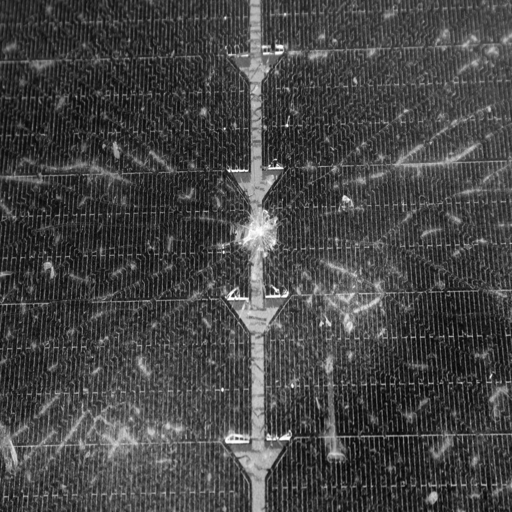
  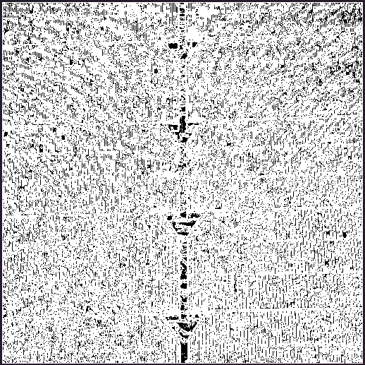
  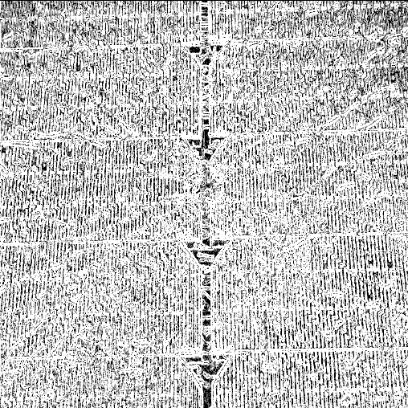
</p>
<p align="center"><em>Left: Input Image | Middle: MATLAB Output | Right: Testbench Output</em></p>

The results show that the testbench implementation closely matches the MATLAB-generated output.

Further validation was performed by comparing the testbench output with the FPGA-generated output obtained through the HPS–FPGA system.

<p align="center">
  
  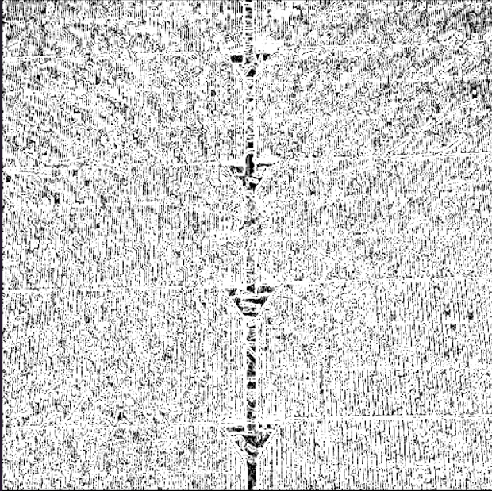
</p>
<p align="center"><em>Left: Testbench Output | Right: FPGA Output</em></p>

The FPGA output matches the testbench results, confirming correct hardware implementation.

> Note: Minor differences may exist compared to MATLAB outputs due to differences in implementation details such as filtering, boundary handling, and numerical precision.


---

## Results

### Classification Accuracy

| Fault Class | Correctly Classified | Total | Accuracy |
|-------------|----------------------|-------|----------|
| Dust | 4 | 5 | 80% |
| Physical Damage | 5 | 5 | 100% |
| Clean | 4 | 5 | 80% |
| **Overall** | **13** | **15** | **86.67%** |

---

### Performance Comparison

| Method | Hardware | 1 Image (ms) | 5 Images (ms) |
|--------|----------|-------------|--------------|
| CPU (Python) | AMD Ryzen 3 7320U, 8 GB RAM | 1927.79 | 9379.92 |
| CPU (Python) | AMD Ryzen 7 6800H, 16 GB RAM | 1259.83 | 6080.18 |
| **HPS–FPGA** | **DE1-SoC (50 MHz FPGA, 800 MHz ARM A9)** | **981.25** | **4906.65** |

The FPGA implementation achieves approximately **2× speedup** over CPU implementations.

---

### Execution Time Comparison (Console Outputs)

<table align="center">
  <tr>
    <td>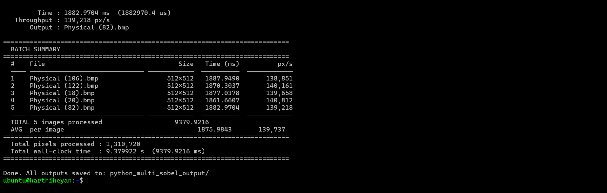</td>
    <td>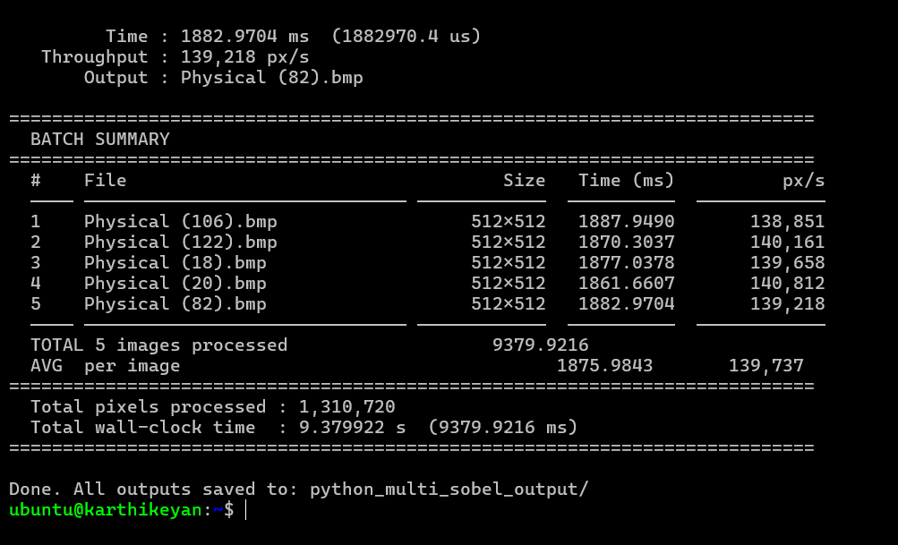</td>
  </tr>
</table>
<p align="center"><em>CPU (Ryzen 3) execution time for single and multiple images</em></p>

<table align="center">
  <tr>
    <td>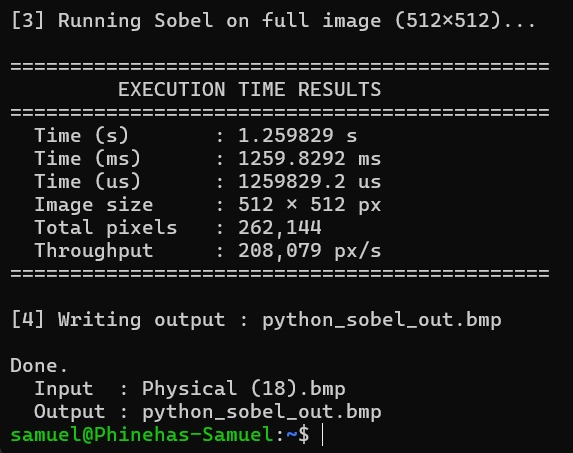</td>
    <td>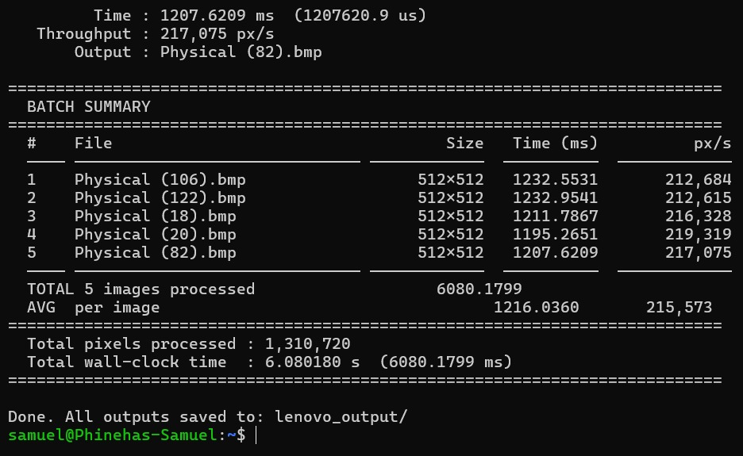</td>
  </tr>
</table>
<p align="center"><em>CPU (Ryzen 7) execution time for single and multiple images</em></p>

<table align="center">
  <tr>
    <td>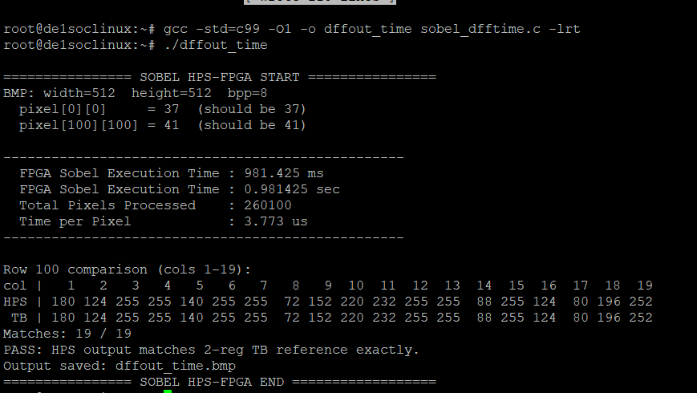</td>
    <td>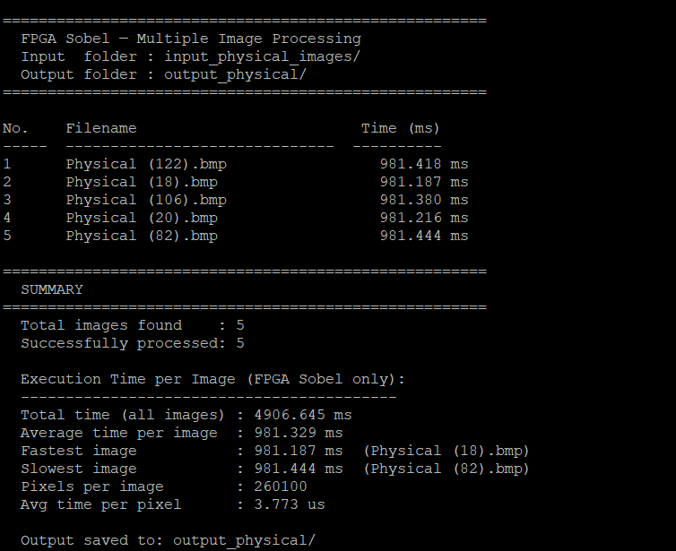</td>
  </tr>
</table>
<p align="center"><em>HPS–FPGA execution time for single and multiple images</em></p>

### Key Insight

The results demonstrate that the **HPS–FPGA hardware–software co-design approach significantly reduces execution time** compared to CPU-only implementations.

By offloading the computationally intensive Sobel edge detection to the FPGA, the system achieves faster processing through hardware-level execution, while the HPS efficiently manages control and post-processing tasks.

This combination enables **low-latency and efficient image processing**, making the approach suitable for real-time embedded applications.

---

## 🔍 Debugging & Validation

- Resolved PIO direction ambiguity (Platform Designer follows HPS perspective) 
- Identified excessive black pixels in FPGA output; ruled out BMP/data issues  
- Root cause: HPS–FPGA clock mismatch (~800 MHz vs 50 MHz) causing multi-cycle `data_valid` and repeated buffer shifts  
- Implemented edge-triggered control using double flip-flop synchronizer to ensure single execution per pixel  
- Achieved correct Sobel output matching testbench and MATLAB results

### Synchronization Logic (2-FF)

```verilog
reg dv_ff1, dv_ff2;

always @(posedge CLOCK_50) begin
    dv_ff1 <= data_valid;
    dv_ff2 <= dv_ff1;
end

wire data_valid_rise = dv_ff1 & ~dv_ff2;
```
### Timing Behavior

<p align="center">
  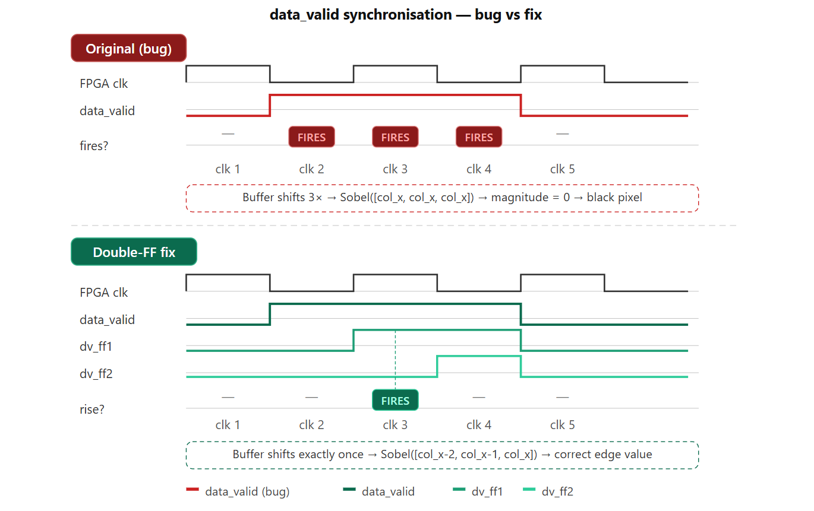
</p>

- Before fix: `data_valid` stays high for multiple FPGA cycles → repeated buffer shifts → incorrect (black) output  
- After fix: Rising-edge detection (2-FF) → single execution per pixel → correct Sobel output  

> Note: Diagram is a conceptual timing illustration of the issue and fix.
### Output Comparison
<table>
<tr>
<th>Before Fix</th>
<th>After Fix</th>
</tr>
<tr>
<td align="center">
  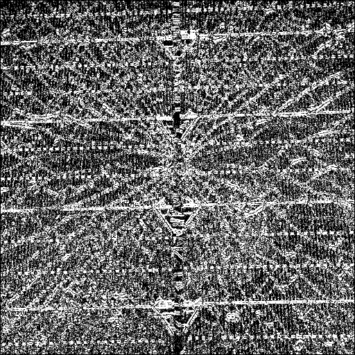
</td>
<td align="center">
  
</td>
</tr>
</table>

- Before fix: Repeated buffer shifts produce excessive black pixels (incorrect edges)  
- After fix: Single-cycle execution yields correct edge-detected image matching testbench  

- Before fix: Repeated buffer shifts produce excessive black pixels (incorrect edges)  
- After fix: Single-cycle execution yields correct edge-detected image matching testbench  

## Limitations & Future Work

- Current Sobel implementation is **not fully pipelined**; introducing staged pipelining can improve throughput  
- Integrating **FIFO buffers and DMA in Platform Designer** can optimize data transfer and further reduce execution time  
- Fault detection uses a **rule-based approach**, which may lead to misclassification in complex scenarios

### Future Scope

- Enable **real-time video processing using camera interfaces**, replacing static image-based input  
- Incorporate **AI/ML-based models** on FPGA or HPS to improve detection accuracy and robustness  

## Team

- **Karthikeyan S**  
- **Aparna S M**  
- **Muhammad Jamaldeen S**  
- **Phinehas Samuel S**

---

## Supervisor

- **Dr. A. Anitha Juliette** — Professor
---


